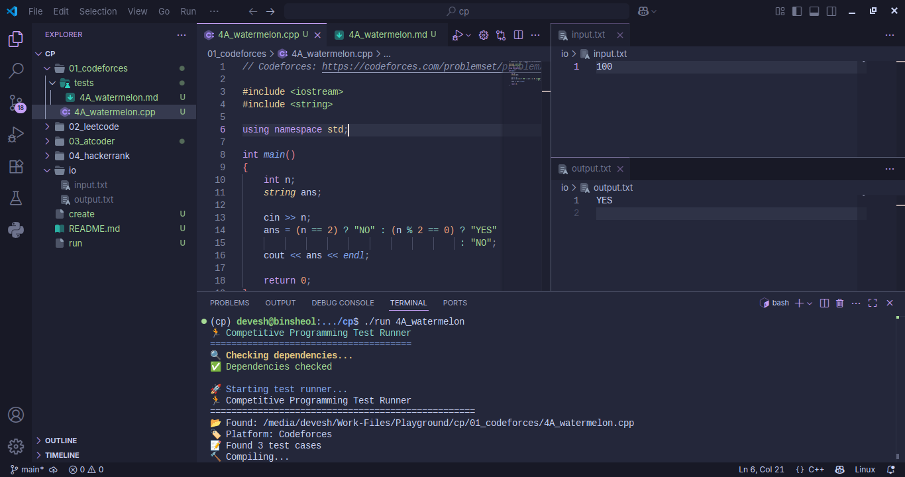

# 🚀 Competitive Programming Workspace

A powerful, automated workspace for competitive programming with support for **Codeforces**, **LeetCode**, **AtCoder**, and **HackerRank**.



## ✨ Features

- 🎯 **Multi-Platform Support**: Codeforces, LeetCode, AtCoder, HackerRank
- 🔧 **Interactive File Generation**: Beautiful CLI interface for creating boilerplate files
- 🧪 **Automated Testing**: Run test cases with performance metrics
- ⚡ **Fast Compilation**: Optimized C++ compilation with proper flags
- 📊 **Detailed Results**: Visual test results with execution time and memory usage
- 🎨 **Rich UI**: Colorful terminal output with progress indicators

## 🛠️ Setup

### Linux/macOS

Run the setup script to install dependencies and configure the workspace:

```bash
./setup.sh
```

### Windows

For Windows users, run the PowerShell setup script:

```powershell
.\setup.ps1
```

Or if you prefer using CMD, first ensure you have uv installed, then manually create the directories.

The setup will:

- Check for `uv` package manager (install manually if not found)
- Initialize a Python virtual environment with uv
- Install required Python packages (`rich`, `inquirer`) using uv
- Create necessary directories
- Make scripts executable (Linux/macOS only)
- Verify system dependencies (g++, uv)

> **Note**: This workspace uses `uv` for Python package management, which provides faster dependency resolution and isolated environments.

## 📁 Project Structure

```folder-structure
cp/
├── create                  # Interactive file generator (Linux/macOS)
├── create.ps1              # Interactive file generator (PowerShell)
├── create.cmd              # Interactive file generator (CMD)
├── run                     # Test runner (Linux/macOS)
├── run.ps1                 # Test runner (PowerShell)
├── run.cmd                 # Test runner (CMD)
├── setup.sh                # Setup script (Linux/macOS)
├── setup.ps1               # Setup script (PowerShell)
├── 01_codeforces/          # Codeforces problems
│   ├── tests/              # Test cases in markdown
│   └── *.cpp               # Solution files
├── 02_leetcode/            # LeetCode problems
├── 03_atcoder/             # AtCoder problems
├── 04_hackerrank/          # HackerRank problems
├── io/                     # Input/output files for testing
└── scripts/                # Python scripts
    ├── file_generator.py   # File creation logic
    └── test_runner.py      # Test execution logic
```

## 🎮 Usage

### Creating New Problems

Use the interactive file generator:

**Linux/macOS:**

```bash
./create
```

**Windows PowerShell:**

```powershell
.\create.ps1
```

**Windows CMD:**

```cmd
create.cmd
```

The script will guide you through:

1. **Platform Selection**: Choose from Codeforces, LeetCode, AtCoder, or HackerRank
2. **File Naming**: Enter the problem name/ID
3. **LeetCode Specifics**: Method name and return type (for LeetCode only)

#### Example - Codeforces Problem

```bash
./create
# Select CodeForces platform
# Enter filename: 4A_watermelon

# Creates: 01_codeforces/4A_watermelon.cpp and 01_codeforces/tests/4A_watermelon.md
```

#### Example - LeetCode Problem

```bash
./create
# Select LeetCode platform
# Enter filename: 1_two-sum
# Enter method name: twoSum
# Enter return type: vector<int>
# Enter parameters: vector<int>& nums, int target

# Creates: 02_leetcode/1_two-sum.cpp and 02_leetcode/tests/1_two-sum.md
```

### Running Tests

### Testing Solutions

Execute tests for any problem:

**Linux/macOS:**

```bash
./run <filename>           # Basic testing
./run <filename> -g -O0    # With additional compile flags
```

**Windows PowerShell:**

```powershell
.\run.ps1 <filename>           # Basic testing
.\run.ps1 <filename> -g -O0    # With additional compile flags
```

**Windows CMD:**

```cmd
run.cmd <filename>           # Basic testing
run.cmd <filename> -g -O0    # With additional compile flags
```

#### Examples

**Linux/macOS:**

```bash
./run 4A_watermelon          # Test 4A.cpp
./run 1_two-sum              # Test two_sum.cpp
./run problem_name -DDEBUG   # Test with debug flag
```

**Windows PowerShell:**

```powershell
.\run.ps1 4A_watermelon          # Test 4A.cpp
.\run.ps1 1_two-sum              # Test two_sum.cpp
.\run.ps1 problem_name -DDEBUG   # Test with debug flag
```

**Windows CMD:**

```cmd
run.cmd 4A_watermelon          # Test 4A.cpp
run.cmd 1_two-sum              # Test two_sum.cpp
run.cmd problem_name -DDEBUG   # Test with debug flag
```

## 📝 Test Case Format

### Standard Problems (Codeforces, AtCoder, HackerRank)

In the generated markdown file anywhere write test cases inside `tests` code-block.

````markdown
# Platform - Problem Name

## Test Cases

```tests
sample input line 1
sample input line 2

expected output line 1
expected output line 2
---
another input

another expected output
```
````

### Standard Problems (LeetCode)

In the generated markdown file anywhere write test cases inside `tests` code-block.

````markdown

# Platform - Problem Name

## Test Cases

```tests
Function: methodName
Sample Input: [2,7,11,15] 9
Sample Output: 0 1
---
Function: methodName
Sample Input: [3,2,4] 6
Sample Output: 1 2
```
````

## ⚡ Performance Features

- **Optimized Compilation**: Uses `-std=c++17 -O2 -Wall -Wextra` flags
- **Fast I/O**: Templates include `ios_base::sync_with_stdio(false)`
- **Memory Tracking**: Shows memory usage per test case
- **Execution Time**: Precise timing for each test
- **Parallel Testing**: Efficient test case execution

## 🏆 Happy Competitive Programming!
